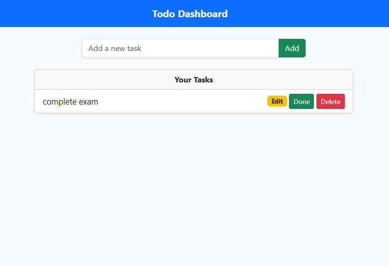
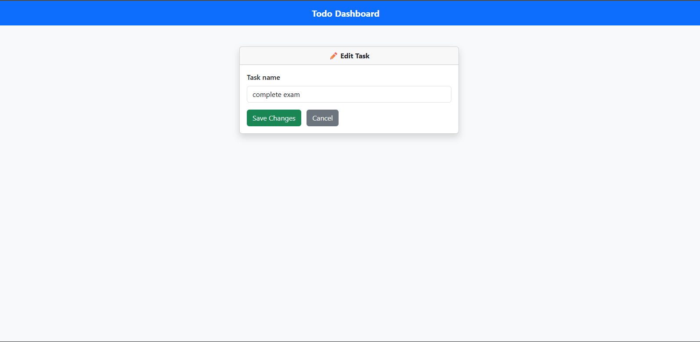

# 📝 Django ToDo List App

A simple, responsive **ToDo List web application** built with **Django** and **Bootstrap 5**.  
Track your daily tasks, mark them as done, edit or delete them — all in one clean dashboard 👌

📍 **Live Demo:** https://todo-list-1-acpq.onrender.com/

---

## 🚀 Features

- ✔️ Add new tasks
- ✏️ Edit existing tasks
- ✅ Mark tasks as done
- ❌ Delete tasks
- 📱 Responsive UI (mobile & desktop)
- 🧠 Built with Python Django & Bootstrap

---

## 🧾 Screenshots

*(Replace these with your own screenshots in `/assets` if available)*

---

## 🛠️ Tech Stack

| Technology | Version |
|------------|---------|
| Python     | 3.10+   |
| Django     | 4.x     |
| Bootstrap  | 5.3     |
| Render     | Hosting |

---

## 📦 Project Structure

